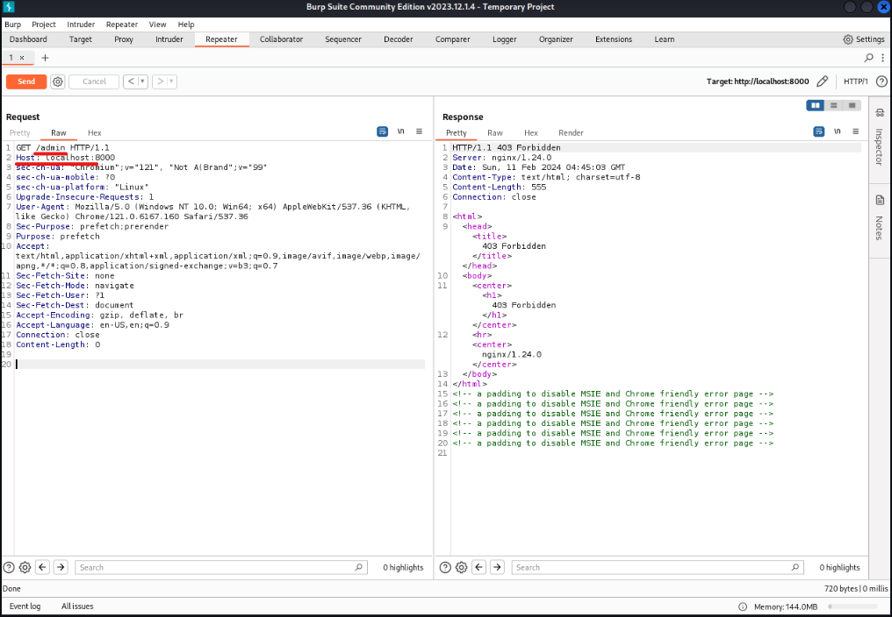
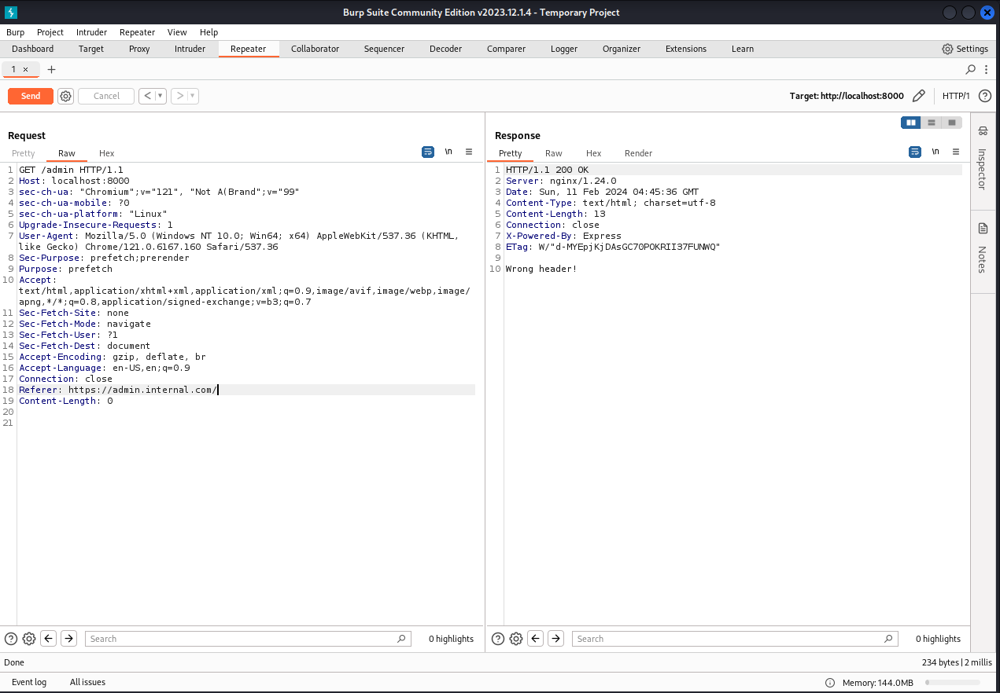
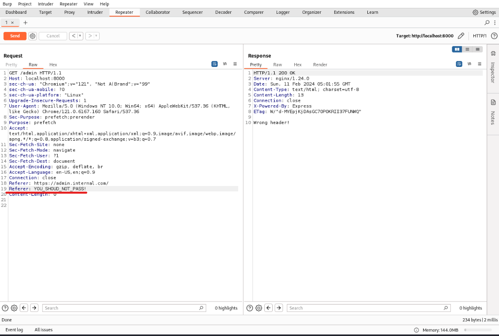

# Writeup Referrrrer from Hero-CTF

## Descrição:
O Writeup em questão, se refere ao desafio Referrrrer, um desafio que envolve a exploração de referrer-policy.
Nesse writeup será explicado como o referer funciona e como sua exploração foi possível.
No desafio, nos foi oferecido um link para download do código fonte [link](./Referrrrer.zip) 

Após levantar o ambiente localmente em docker, e acessa-lo observamos a seguinte tela abaixo:

 

olhandos nos arquivos do zip que foi nos passado, procuramos por possíveis brechas ou insights que possam haver 
no código.
Logo de cara, dois arquivos chamam mais nossa atençao pelo seu conteúdo:  nginx.conf e index.js

No arquivo do nginx.conf, conforme ilustrado abaixo, nós obervamos que o proxy do nginx  ao fazer um GET em /admin está trabalhando com um condicional que valida se  a variável http_referer é diferente de "https://admin.internal.com" e para qualquer refer que for diferente desse valor, seja retornado um status code 403.

Logo, utilizando o burp para verificar o header, resolvemos fazer um GET em /admin, e obtivemos o retorno de um status-code 403

Na requisicao acima, incrementamos o parâmetro
Referer: https://admin.internal.com/ , conforme a validação presente no arquivo do nginx.conf anteriormente estava tratando, e obtivemos uma resposta diferente, conforme abaixo:  Wrong header

Olhando o arquivo de index.js podemos observar de onde essa resposta veio, e que aqui está presente uma segunda tratativa, agora por parte do express do js, onde o condicional if diz que se qualquer referer for igual a "YOU_SHOUD_NOT_PASS!" o returno seria res.send(process.env.FLAG), o que parece ser a flag.

Voltamos ao burp e tentamos passar esse Referer = YOU_SHOUD_NOT_PASS!", porém, dessa vez não obtivemos sucesso e o retorno ainda é Wrog Header ao inveś de trazer a flag.

E é agora que paramos no ponto central desse desafio, sabemos que de alguma forma esses dois referers aparentam  serem requeridos, porém não sabemos como.
Durante algumas pesquisas, podemos entender melhor sobre o refer. Trata-se de um cabeçalho que passa a origem do host solicitante para a aplicação  que está sendo requerida, porém, esse tipo de cabeçalho pode expor informações privadas de um host para o servidor alvo, se tornando por tanto um ponto vulnerabilidade.

Após uma busca mais aprofundada em https://developer.mozilla.org/pt-BR/docs/Web/HTTP/Headers/Referrer-Policy , temos logo no início do documento uma nota:
    " Nota: O nome original do cabeçalho Referer é um erro ortográfico da palavra "referrer". O cabeçalho Referrer-Policy não compartilha do mesmo erro ortográfico."

Pesquisando um pouco mais sobre o referer para requisições do Express js, encontramos que uma das formas antigas de requisição é o referer que é escrito errado desde 1996 e o express utiliza a ortografia mais atual 'referrer'. passamos ele no burp da seguinte forma:

Com isso, nós conseguimos capturar a flag.
Isso ocorre porquê o referer é um cabeçalho que nos permite passar informações de origem do servidor, e o express possui uma brecha nesse cenário que nos permitiu passar o cabeçalho na ortografia 'referrer'.

Por tanto, usamos o 'referer' para passar pelo proxy do nginx, e o 'referrer' para passar pela aplicação do js.
Essa brecha poderia ter sido evitada se o site utiliza-se, por exemplo, o Referrer-Policy: no-referrer, que indica ao site para não usar nenhum tipo de referer/referrer durante as requisições.